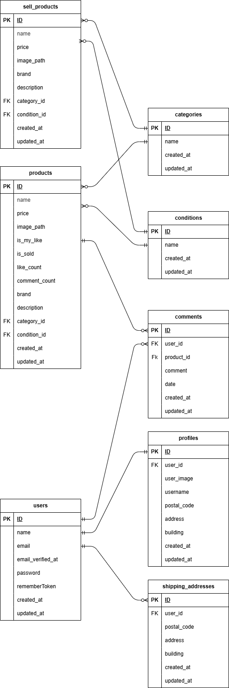

## アプリケーション名

フリマアプリ

## 環境構築

リポジトリからダウンロード

```
git clone https://github.com/sazenshinji/shigeno-sp1a-furima.git
```

「.env.example」をコピーして「.env」を作成し DB の設定を変更

```
cp .env.example .env
```

```
DB_CONNECTION=mysql
DB_HOST=mysql
DB_PORT=3306
DB_DATABASE=laravel_db
DB_USERNAME=laravel_user
DB_PASSWORD=laravel_pass
```

docker コンテナを構築

```
docker-compose up -d --build
```

php コンテナにログインして Laravel をインストール

```
docker-compose exec php bash
composer install
```

アプリケーションキーを作成

```
php artisan key:generate
```

DB のテーブルを作成

```
php artisan migrate:fresh
```

DB のテーブルにダミーデータを投入

```
php artisan db:seed
```

"The stream or file could not be opened"エラーが発生した場合
src ディレクトリにある storage ディレクトリに権限を設定

```
chmod -R 777 storage
```

シンボリックリンクを作成

```
php artisan storage:link
```

## 使用技術(実行環境)

PHP 7.4.9 (cli) (built: Sep 1 2020 02:33:08) ( NTS )

Laravel Framework 8.83.8

mysql Ver 8.0.26 for Linux on x86_64 (MySQL Community Server - GPL)

nginx version: nginx/1.21.1

## URL

商品一覧画面（トップ画面）：http://localhost/

商品一覧画面（トップ画面）\_マイリスト：http://localhost/?tab=mylist

会員登録画面：http://localhost/register

ログイン画面：http://localhost/login

商品詳細画面：http://localhost/products/{id}

商品購入画面：http://localhost/products/{id}/purchase

住所変更ページ：http://localhost/profile/edit-temp?product_id={id}

商品出品画面：http://localhost/products/create

プロフィール画面：http://localhost/profile

プロフィール編集画面：http://localhost/profile/edit?from=profile

プロフィール画面\_購入した商品一覧：http://localhost/profile

プロフィール画面\_出品した商品一覧：http://localhost/profile

## ER 図


