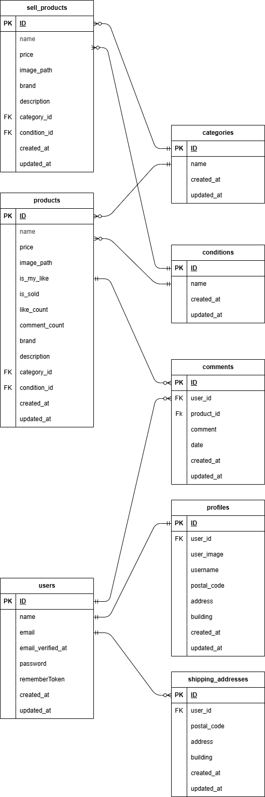

## アプリケーション名

coachtechフリマ

## 環境構築

リポジトリからダウンロード

```
git clone https://github.com/sazenshinji/shigeno-sp1a-furima.git
```

「.env.example」をコピーして「.env」を作成し DB の設定を変更

```
cp .env.example .env
```

```
DB_CONNECTION=mysql
DB_HOST=mysql
DB_PORT=3306
DB_DATABASE=laravel_db
DB_USERNAME=laravel_user
DB_PASSWORD=laravel_pass
```

docker コンテナを構築

```
docker-compose up -d --build
```

php コンテナにログインして Laravel をインストール

```
docker-compose exec php bash
composer install
```

アプリケーションキーを作成

```
php artisan key:generate
```

DB のテーブルを作成

```
php artisan migrate:fresh
```

DB のテーブルにダミーデータを投入

```
php artisan db:seed
```

"The stream or file could not be opened"エラーが発生した場合
src ディレクトリにある storage ディレクトリに権限を設定

```
chmod -R 777 storage
```

シンボリックリンクを作成

```
php artisan storage:link
```

=================================================================================

〇「Stripe」の導入について

１．準備

1.1 アカウントの準備と API キーの取得

　・Stripe アカウントを準備してください。

　・Stripe のダッシュボードで API キー（公開可能キー / 秘密キー）を取得してください。

　　　公開キー: pk_test_xxxxx

　　　秘密キー: sk_test_xxxxx

1.2 Stripe のインストール と .env ファイルの編集

　・Laravel に Stripe をインストールしてください。

　　　 bash

　　　 composer require stripe/stripe-php


・.env に 取得した API キーを追加します。

　　　 STRIPE_KEY=pk_test_xxxxx

　　　 STRIPE_SECRET=sk_test_xxxxx


２．Stripe 決済 カード支払時の入力情報 例

　・メールアドレス：test@example.com

　・カード情報：4242 4242 4242 4242 将来の日付 任意の 3 桁

　・カード名義：Stripe Test


３．Stripe 決済 コンビニ払い時の入力情報 例

　・メールアドレス：test@example.com

　・カード名義：Stripe Test

　・電話番号：(未入力)


=================================================================================

〇「PHPUnit による単体テスト」について

１．準備

1.1 テスト用のデータベースの準備

　・MySQL コンテナに入る。

　　　 bash

　　　 cd coachtech/shigeno-sp1a-furima/

　　　 docker-compose exec mysql bash


・root ユーザ(管理者)でログイン。

　　　 bash

　　　 mysql -u root -p

　　　 root


・「demo_test」というデータベースを作成する。

　　　 bash

　　　 CREATE DATABASE fleama_test;


1.2 src/config/database.php ファイルの変更

　・mysql の配列部分をコピーし、新たに mysql_test 配列を作成し、

　　配列の中の database、username、password を以下の様に変更する。

　　　　(項目) ：(変更前) → (変更後)

　　　　'database' ：env('DB_DATABASE', 'forge') → 'demo_test'

　　　　'username' ：env('DB_USERNAME', 'forge') → 'root'

　　　　'password' ：env('DB_PASSWORD', '') → 'root'


1.3 テスト用の.env ファイル作成

・PHP コンテナにログインし、.env をコピーして.env.testing というファイルを作成

　　　 PHP コンテナ

　　　 bash

　　　 cp .env .env.testing


・コピーしファイルの権限変更

　　　 sudo chmod -R 777 *

　　　 (パスワードを入力)


・.env.testing ファイルを以下の様に編集する

　　　　「文頭部分の APP_ENV と APP_KEY」の変更

　　　　　　　----------------------------------------------------------------

　　　　　　　 APP_NAME=Laravel

　　　　　　　- APP_ENV=local

　　　　　　　- APP_KEY=base64:vPtYQu63T1fmcyeBgEPd0fJ+jvmnzjYMaUf7d5iuB+c=

　　　　　　　+ APP_ENV=test

　　　　　　　+ APP_KEY=

　　　　　　　 APP_DEBUG=true

　　　　　　　 APP_URL=http://localhost

　　　　　　　----------------------------------------------------------------

　　　　「データベースの接続情報」の変更

　　　　　　　----------------------------------------------------------------

　　　　　　　 DB_CONNECTION=mysql_test

　　　　　　　 DB_HOST=mysql

　　　　　　　 DB_PORT=3306

　　　　　　　- DB_DATABASE=laravel_db

　　　　　　　- DB_USERNAME=laravel_user

　　　　　　　- DB_PASSWORD=laravel_pass

　　　　　　　+ DB_DATABASE=demo_test

　　　　　　　+ DB_USERNAME=root

　　　　　　　+ DB_PASSWORD=root

　　　　　　　----------------------------------------------------------------

　・APP_KEY に新たなテスト用のアプリケーションキーを加える

　　　 bash

　　　 php artisan key:generate --env=testing


1.4 キャッシュの削除とテスト用のテーブルの作成

　・キャッシュの削除を行う


　　　 bash

　　　 php artisan config:clear


・テスト用のテーブルの作成を行う

　　　 bash

　　　 php artisan migrate --seed --env=testing


1.5 PHPUnit の設定ファイル「phpunit.xml」の編集

　（★ 編集済のため作業不要です。）


２．テストの実行

　・すべてのテストを実行

　　　 bash

　　　 php artisan test


・特定のテストを実行

　　　 bash

　　　 php artisan test --filter=(Feature テストファイル名)


=================================================================================

〇「メールを用いた認証機能(MailHog)」について

１．準備

1.1 MailHog コンテナを Docker に追加

　・docker-compose.yml に MailHog サービスを追加する。

　　　　----------------------------------------

version: '3.8'

services:


        【中略】


          mailhog:

            image: mailhog/mailhog

            container_name: mailhog

            ports:

              - "1025:1025"   # SMTPポート

              - "8025:8025"   # Web UIポート


---


1.2 .env ファイルの設定

　・「MAIL_」部分を以下の様に編集します。

　　　　----------------------------------------


        MAIL_MAILER=smtp

        MAIL_HOST=mailhog

        MAIL_PORT=1025

        MAIL_USERNAME=null

        MAIL_PASSWORD=null

        MAIL_ENCRYPTION=null

        MAIL_FROM_ADDRESS=example@example.com

        MAIL_FROM_NAME="${APP_NAME}"


---


1.3 Docker コンテナを再起動

　　　 bash

　　　 docker-compose up -d --build


=================================================================================

## 使用技術(実行環境)

PHP 7.4.9 (cli) (built: Sep 1 2020 02:33:08) ( NTS )

Laravel Framework 8.83.8

mysql Ver 8.0.26 for Linux on x86_64 (MySQL Community Server - GPL)

nginx version: nginx/1.21.1

jquery：v3

## URL
開発環境：http://localhost/

phpMyAdmin：http://localhost:8080/

商品一覧画面（トップ画面）：/

商品一覧画面（トップ画面）_マイリスト：/?tab=mylist

商品一覧画面（トップ画面）_おすすめ：/?tab=recommend

ログイン画面：/login

会員登録画面：/register

メール認証誘導画面：/email/verify

プロフィール設定画面_初回ログイン時：/profile/edit

商品詳細画面：/products/{id}

商品購入画面：/products/{id}/purchase

住所変更ページ：/profile/edit-temp?product_id={id}

商品出品画面：/products/create

プロフィール画面：/profile

プロフィール編集画面：/profile/edit?from=profile

プロフィール画面_購入した商品一覧：/profile?tab=buy

プロフィール画面_出品した商品一覧：/profile?tab=sell

## ER 図


